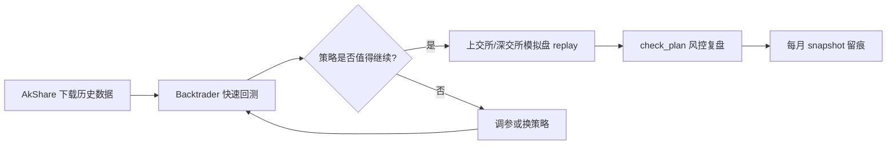

## 一句话

面向 A 股量化初学者的 **「数据 → 回测 → 模拟盘 → 风控复盘」** 学习框架。

| 项目做什么？ | A 股量化入门：下载数据 → Backtrader 回测 → 沪深模拟盘 → 50 万账户风控 |
| ------ | ----------------------------------------------- |
| 能练对冲吗？ | 能练 **资金分仓式风险对冲**（生存仓 + 验证仓），不是衍生品配对对冲           |

# dev2hedge 项目说明 + 茅台策略验证闭环教程

## 一、这个项目实现了什么？

**dev2hedge** 是一个面向 A 股量化初学者的 **「数据 → 回测 → 模拟盘 → 风控复盘」** 学习框架，并不是专业意义上的「期货/期权 Delta 对冲」系统。

它实现的核心能力如下：

| 模块 | 功能 |
|------|------|
| **数据层** | 用 AkShare 拉取 A 股近 10 年前复权日线，缓存为 `data/cache/{代码}.parquet` |
| **回测层** | 用 Backtrader 跑策略（内置双均线），输出收益率、最大回撤、夏普等 |
| **模拟盘** | 按历史 K 线逐日回放，模拟 A 股规则：整手 100 股、T+1、涨跌停拒单、万三佣金 + 卖出印花税 |
| **账户规划** | 50 万总资金拆成「生存仓 37.5 万 + 验证仓 12.5 万」，配套风控红线 |
| **风控检查** | `check_plan.py` 自动检查仓位、回撤是否触线 |

整体流程可以概括为：



**关于「对冲」：** 项目名里的 hedge，更贴近 **资金层面的风险对冲**——75% 生存仓买宽基 ETF/债基（在券商手动管理），25% 验证仓用本软件练系统化策略，避免「全仓赌一只股」。不是「做多茅台 + 做空沪深300」那种配对对冲。

---

## 二、用茅台（600519）设计一个入门策略

茅台在上交所，代码 **600519**，demo 股票池已包含它。

### 推荐策略：双均线趋势跟踪（项目内置）

逻辑（见 `strategies/dual_ma.py` 和 `signals/dual_ma.py`）：

- **买入**：10 日均线上穿 30 日均线（金叉）
- **卖出**：10 日均线下穿 30 日均线（死叉）
- **仓位**：模拟盘最多用验证仓权益的 **90%** 买入（单标的实际上限 15%，见下文）

### 为什么选这个策略练手？

1. 项目已完整实现，零改代码就能跑通闭环  
2. 茅台波动相对大，均线交叉信号较多，适合观察  
3. 能直观对比「回测结果」和「模拟盘结果」的差异（T+1、涨跌停等）

### 重要纪律（账户规划）

按 `config/account_plan.py`：

- 模拟盘初始资金：**12.5 万**（验证仓规模）
- 单标的（茅台）上限：**≤ 验证仓权益的 15%**（约 1.875 万）
- 总仓位上限：**≤ 90%**
- 单笔最大亏损：**≤ 总本金 2%（1 万）**

> 新手练闭环时，可以先用默认 90% 仓位理解流程；正式验收时应遵守 15% 单标的上限。全仓茅台会触发风控违规。

### 策略预期（真实回测参考）

我在本地对茅台跑了回测（100 万初始资金、近 10 年数据）：

| 指标 | 结果 |
|------|------|
| 总收益率 | **约 0.02%**（几乎持平） |
| 最大回撤 | **约 14.7%** |

这说明：**双均线在茅台上近 10 年并不赚钱**。这恰恰是回测的价值——在实盘前发现策略无效，而不是靠感觉交易。

---

## 三、新手一步步操作指南（完整闭环）

以下假设你在 macOS，项目路径为 `/Users/Shared/sandbox/dev2hedge`。

### 第 0 步：环境准备（只需做一次）

```bash
cd /Users/Shared/sandbox/dev2hedge
python3 -m venv .venv
source .venv/bin/activate
pip install -r requirements.txt
```

激活后，终端提示符前会出现 `(.venv)`。

---

### 第 1 步：下载茅台历史数据

```bash
python scripts/download_data.py --universe demo
```

- `demo` 会下载 5 只样本股，其中包括 **600519（贵州茅台）**
- 数据保存在 `data/cache/600519.parquet`
- 若已有缓存会跳过；强制重下加 `--force`

验证是否成功：

```bash
ls data/cache/600519.parquet
```

---

### 第 2 步：Backtrader 快速回测（验证策略逻辑）

```bash
python scripts/run_backtest.py --symbol 600519
```

你会看到类似输出：

```
=== 600519 双均线回测 ===
初始资金: 1,000,000.00
期末资金: 1,000,226.77
总收益率: 0.02%
最大回撤: 0.147...
夏普(近似): ...
```

**怎么读结果：**

| 看什么 | 含义 | 新手判断 |
|--------|------|----------|
| 总收益率 | 策略赚/亏多少 | > 0 且明显跑赢存银行才有继续价值 |
| 最大回撤 | 从高点最多跌多少 | > 20% 对新手偏激进 |
| 夏普 | 风险调整后收益 | 负值通常说明策略不稳定 |

可选：加 `--plot` 看 K 线与均线（需图形界面）：

```bash
python scripts/run_backtest.py --symbol 600519 --plot
```

**决策点：** 若回测明显亏损或回撤过大，应调参（如 5/20 均线）或换策略，不要直接进入模拟盘。

---

### 第 3 步：上交所模拟盘历史回放（更贴近「真实交易」）

茅台属于上交所，用 `run_sse_paper.py`：

```bash
# 重置为 12.5 万验证仓，从头回放全部历史
python scripts/run_sse_paper.py replay --symbol 600519 --reset
```

模拟盘比回测多了：

- T+1（今天买的明天才能卖）
- 涨跌停无法成交
- 整手 100 股
- 佣金 + 印花税
- 初始资金 12.5 万（对齐验证仓）

查看账户状态：

```bash
python scripts/run_sse_paper.py status
```

账户文件在 `data/paper/sse/account.json`，每笔委托在 `data/paper/sse/orders.jsonl`。

> **权限提示：** 若出现 `Permission denied: account.json`，说明该文件属主不是当前用户。可执行：
> ```bash
> sudo chown -R $(whoami) data/paper/
> ```
> 然后再跑 `replay --reset`。

---

### 第 4 步：对比回测 vs 模拟盘

| 对比项 | 回测 (`run_backtest.py`) | 模拟盘 (`run_sse_paper.py`) |
|--------|--------------------------|------------------------------|
| 初始资金 | 100 万 | 12.5 万 |
| T+1 | 未模拟 | 有 |
| 涨跌停 | 未模拟 | 有 |
| 信号来源 | Backtrader 内嵌 | pandas 版 `dual_ma_signals` |

两者方向应大致一致；若差异大，常见原因：T+1 导致卖出延迟、涨跌停拒单、信号在收盘才确认等。

---

### 第 5 步：风控检查与月度复盘

```bash
# 查看 50 万账户规划 + 纸交易验收清单
python scripts/check_plan.py

# 仅检查上交所模拟盘风控
python scripts/check_plan.py --exchange sse

# 记录今日权益快照（建议每月做一次）
python scripts/check_plan.py --exchange sse --snapshot
```

会自动检查：

- 单标的是否超过 15%
- 总仓位是否超过 90%
- 回撤是否触线（验证仓年度 ≤ 18% 等）

---

### 第 6 步：模拟「每日跟盘」（可选）

若已有模拟盘账户，可每天处理最新一根 K 线：

```bash
# 先更新数据（重新下载 demo 或单票）
python scripts/download_data.py --universe demo --force

# 处理最新交易日信号
python scripts/run_sse_paper.py daily --symbol 600519
```

---

### 第 7 步：闭环验收清单

按 `docs/ACCOUNT_PLAN.md`，完成以下即算跑通一个验证闭环：

1. 数据下载成功  
2. 回测跑通并记录收益率、回撤  
3. 模拟盘 `replay --reset` 跑通  
4. `check_plan.py` 无硬性违规（`✗`）  
5. 手动记录：回测与模拟盘方向是否一致、差异原因  
6. 连续 6 个月每月 `--snapshot`（长期验收）

---

## 四、完整命令速查（复制即用）

```bash
cd /Users/Shared/sandbox/dev2hedge
source .venv/bin/activate

# 1. 下载数据
python scripts/download_data.py --universe demo

# 2. 回测茅台
python scripts/run_backtest.py --symbol 600519

# 3. 模拟盘回放（重置 12.5 万）
python scripts/run_sse_paper.py replay --symbol 600519 --reset

# 4. 查账户
python scripts/run_sse_paper.py status

# 5. 风控复盘
python scripts/check_plan.py --exchange sse --snapshot
```

---

## 五、进阶练习（验证策略是否真的「盈利」）

当前双均线在茅台上近 10 年几乎不赚，可尝试：

1. **参数扫描**：改 `config/settings.py` 里 `BACKTEST` 的 `fast_ma` / `slow_ma`（如 5/20、20/60），重复第 2～3 步  
2. **加 RSI 过滤**：RSI < 70 才做多（需改 `strategies/dual_ma.py`）  
3. **换标的**：茅台偏价值/消费，趋势策略可能更适合 ETF（如 510300），命令把 `600519` 换成 `510300`  
4. **/** **遵守 15% 单标的上限**：在 `engine/paper_sim.py` 里把 `position_pct` 从 0.9 改为 0.15，更贴近真实纪律  

---

## 六、你需要知道的几条限制

- AkShare 是爬虫接口，字段或接口可能变更，需网络  
- 回测未完全模拟滑点、停牌、分红除权等细节  
- **不构成投资建议**；本项目目标是练流程和风控，不是保证盈利  
- 生存仓 37.5 万在券商手动管理，本软件不管那部分  

---

## 总结

| 问题         | 答案                                                 |
| ---------- | -------------------------------------------------- |
| 项目做什么？     | A 股量化入门：下载数据 → Backtrader 回测 → 沪深模拟盘 → 50 万账户风控    |
| 能练对冲吗？     | 能练 **资金分仓式风险对冲**（生存仓 + 验证仓），不是衍生品配对对冲              |
| 茅台例子？      | 600519，上交所，`run_sse_paper.py`                      |
| 闭环路径？      | 下载 → 回测 → 模拟盘 replay → check_plan 风控 → 每月 snapshot |
| 双均线在茅台上好吗？ | 近 10 年回测几乎持平，说明需调参或换策略，这正是回测的意义                    |

如果你希望，我可以下一步帮你：**改一版「15% 仓位 + RSI 过滤」的茅台策略**，或写一个简单的 **参数扫描脚本**，自动对比多组均线在茅台上的收益。